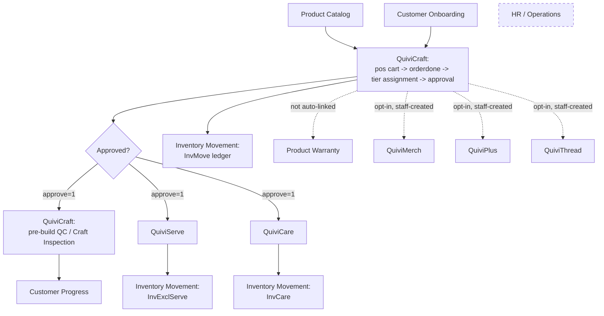

# System Workflow

End-to-end map of how a customer/order moves through Quivitech. This note is the high-level orchestration view — detail for each connected module now lives in its own note (linked below) rather than duplicated here. For schema detail see [[Domain-Models]], for request routing see [[Architecture]].

## High-level flow

## Modules, in flow order

1. **[[Product-Catalog]]** — the sellable catalog (`Products`, `Categories`, `SubCategories`, `Brand`, `Suppliers`) that every order line item draws from.
2. **[[Customer-Onboarding]]** — `Customer` registration and the optional pre-order `Meeting` consultation.
3. **[[QuiviCraft]]** — the `Order` itself: POS cart staging, checkout (`PosController::orderdone()`), the craft/serve/care tier-assignment logic, order approval, and QuiviCraft's own pre-build QC (Craft Inspection). This is the hinge everything downstream depends on.
4. **[[QuiviServe]]** — post-build service perks (BEK/MPS/PCE tiers), claim tracking, promo codes.
5. **[[QuiviCare]]** — repair/RMA and warranty program, spare-parts issuance.
6. **[[Customer-Progress]]** — free-form staff status updates, not tied to any tier system.
7. **[[Product-Warranty]]** — a standalone per-serial warranty registry that looks like it should auto-link to orders but doesn't.
8. **[[Inventory-Movement]]** — the spare-parts/stock catalog (`MasterSku`) and ledger (`InvMove`), plus the `InvCare`/`InvExclServe` pools consumed by QuiviCare/QuiviServe.
9. **[[QuiviMerch]]**, **[[QuiviPlus]]**, **[[QuiviThread]]** — merch store, paid add-on services, and the custom-cable BOM configurator. Unlike Serve/Care, none of these three auto-create from order approval — they're opt-in and staff-initiated, with an optional link back to a `Customer`/`Order`.
10. **[[HR-Operations]]** — `Employees`/`Salaries`/`Expenses`, entirely disconnected from the customer/order flow above.

## Known gaps / caveats

- Auto tier assignment can **change** an order's craft/serve/care tier after the fact if line items are edited post-approval — re-check whether `ServeData`/`CareData` get updated to match, or just the `order` row (not yet audited; see [[Work-In-Progress]] before assuming).
- `CareDataController::statistics()` is broken (`/api/care-data/statistics` 500s) — see [[Domain-Models]].
- `ProductRaw` and the `carts`/`Cart` table+model both look like scaffolding for flows that were never finished or were superseded by `pos`/`Products` directly — don't assume either is live-wired without checking the controller first. See [[Product-Catalog]] and [[QuiviCraft]].
- The dev DB has repeatedly been reprovisioned from raw SQL dumps rather than `artisan migrate`, which resets `migrations` bookkeeping but not schema — see [[Dev-Setup]] before trusting `migrate:status`.

## Related
- [[General]]
- [[Domain-Models]]
- [[Architecture]]
- [[API-Routes]]
- [[Work-In-Progress]]
