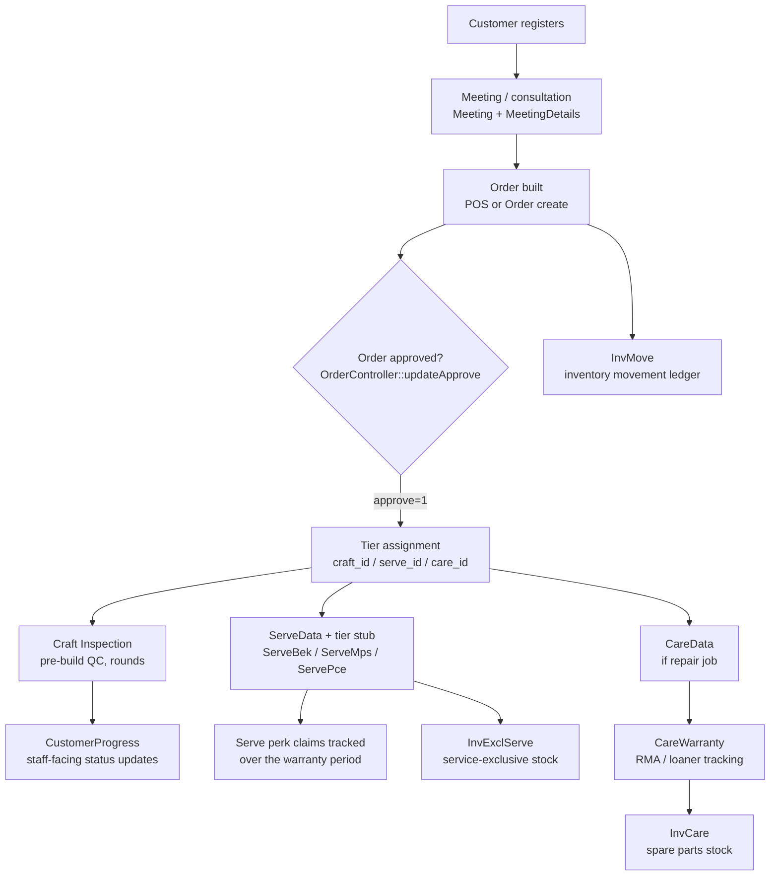

# System Workflow

End-to-end walk of how a customer/order moves through Quivitech, wiring together the pieces documented separately in [[Domain-Models]] and [[API-Routes]]. This note is about **process/data flow** — for schema detail see [[Domain-Models]], for request routing see [[Architecture]].

## High-level flow

## 1. Customer & meeting

- A `Customer` is created (registration form / staff entry), gets a `customer_id` business code (`QVCST-XXXX`).
- Optionally, a `Meeting` (+`MeetingDetails`) is logged before the order — captures budget, use-case (work/gaming), theme preferences, target build date. Not required to place an order.

## 2. Order creation

- An `Order` is built via POS (`PosController`) or the order form, with `OrderDetails` line items (product + qty + price).
- At this point `craft_id` / `serve_id` / `care_id` on the order are **provisional** — they get finalized (and can change) both at order-detail update time and again at approval time, using the tier logic below.

## 3. Tier assignment logic

All three tier systems are recomputed from the order's line items — **not** manually chosen by staff:

| Tier system | Basis | Bands |
|---|---|---|
| **Craft** (build class) | `sub_total` of all line items | ≤6,999 → BASIC(1); ≤9,999 → MEDIUM(3); ≤19,999 → PREMIUM(2); else → ULTRA(4) |
| **Serve** (service perks) | `sub_total` of all line items | <7,000 → Essential Kit(1); <10,000 → Prime Series(2); else → Collector's Edition(3) |
| **Care** (RMA/repair fee) | sum of **RMA-eligible categories only** (`OrderController::CARE_ELIGIBLE_CATEGORIES`), not the whole order | granular RM1,000 bands, see `OrderController::resolveCareTier()` — e.g. 0–5,999 → tier 1 / RM379, 7,000–7,999 → tier 2 / RM689, above 20,999 → tier 3 / RM2,479 |

This logic is duplicated in `OrderController::update()` / `updateApprove()` and `PosController::orderdone()` — see [[Domain-Models]]'s "Repair/service domain" section for known bugs already fixed here (e.g. `ServeBek`/`ServeMps` stub creation).

## 4. Approval

- `OrderController::updateApprove()` (`approve=1`) is the trigger point. On approval it:
  1. Locks in the tier IDs.
  2. Calls `updateserve()` → creates the `ServeData` row (business code `{serves.code}-XXXX`, e.g. `PCE-2610-0001`) and the matching tier sub-record (`ServeBek`/`ServeMps`/`ServePce`) with its own perk-tracking columns.
  3. If the order is a repair/Care job, creates the matching `CareData` row (`{care.code}-XXXX`).
- A quick-launch button on the order list (`allorder.vue`) resolves/creates the `ServeBek`/`ServeMps` record on demand (`find-or-create` via `getByOrder`) so staff don't need to search for a QVSE CID first. PCE isn't part of this shortcut — it has its own richer create/edit flow.

## 5. Post-approval tracks (parallel, not sequential)

**Craft Inspection** (pre-build QC) — `CraftInspection` (per order, can have multiple `round`s) → `CraftInspectionItem` per component (cpu/mbd/gpu/ram/ssd/aio/psu/...), each tracking inspection/packaging/condition status + photos.

**Serve perk claims** — each `ServeBek`/`ServeMps`/`ServePce` row tracks its tier's perks (onsite troubleshooting, cable management, dust cleaning, upgrade-service discounts, promo codes) as boolean-claimed + claim-date pairs, valid over the tier's coverage window (1/2/3+ years depending on tier). Staff mark a perk "claimed" as the customer uses it.

**Care / warranty (repair jobs)** — `CareData` (the actual repair job) → `CareWarranty` (per-component RMA/warranty eligibility, optional loaner tracking via `loan_date_end`) → if a spare part is issued, draws from `InvCare` (spare/RMA stock, keyed by `sku_code` → `master_sku`).

**Customer progress** — free-form staff updates (`CustomerProgress`, replaced the old `Document` model) attached to a customer and optionally an order — used for build-status communication, not tied to any of the tier systems above.

## 6. Inventory movement (mostly independent)

- `InvMove` is a general ledger of stock movement (in/out, by `master_sku` + `destination`), optionally linked to an `order_id`. Not auto-populated by the order/approval flow above — entered separately (e.g. from supplier receipts, or physical stock counts).
- `InvCare` (spare/RMA parts) and `InvExclServe` (service-exclusive consumables) are narrower, purpose-specific stock pools consumed by the Care/Serve tracks above, not by `InvMove`.

## Known gaps / caveats

- Auto tier assignment can **change** an order's craft/serve/care tier after the fact if line items are edited post-approval — re-check whether `ServeData`/`CareData` get updated to match, or just the `order` row (not yet audited; see [[Work-In-Progress]] before assuming).
- `CareDataController::statistics()` is broken (`/api/care-data/statistics` 500s) — see [[Domain-Models]].
- The dev DB has repeatedly been reprovisioned from raw SQL dumps rather than `artisan migrate`, which resets `migrations` bookkeeping but not schema — see [[Dev-Setup]] before trusting `migrate:status`.

## Related
- [[Domain-Models]]
- [[Architecture]]
- [[API-Routes]]
- [[Work-In-Progress]]
